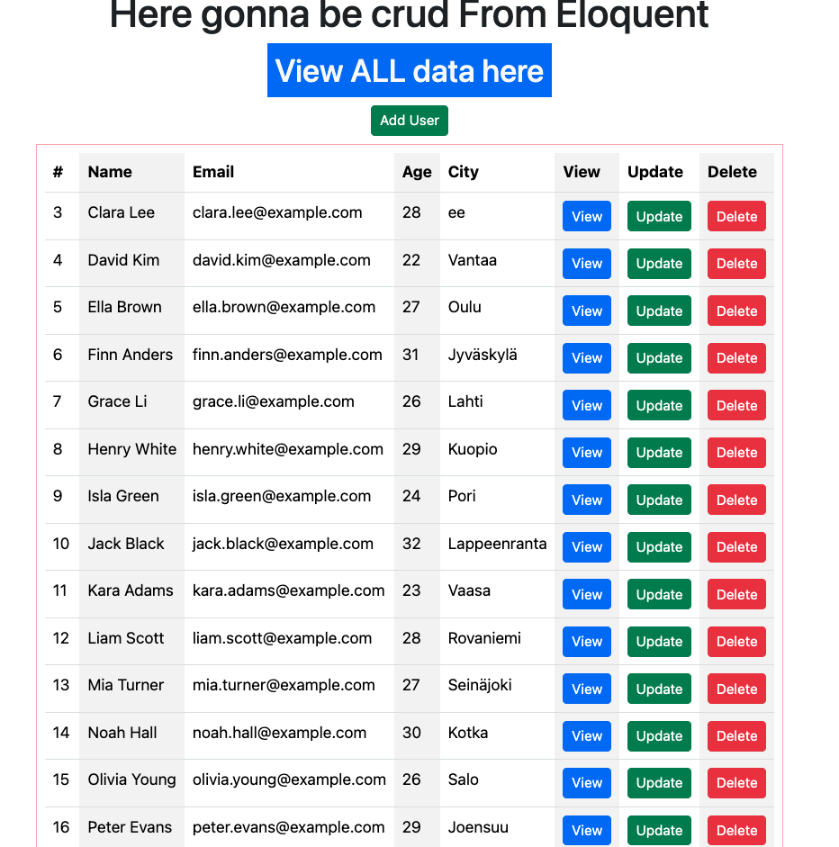
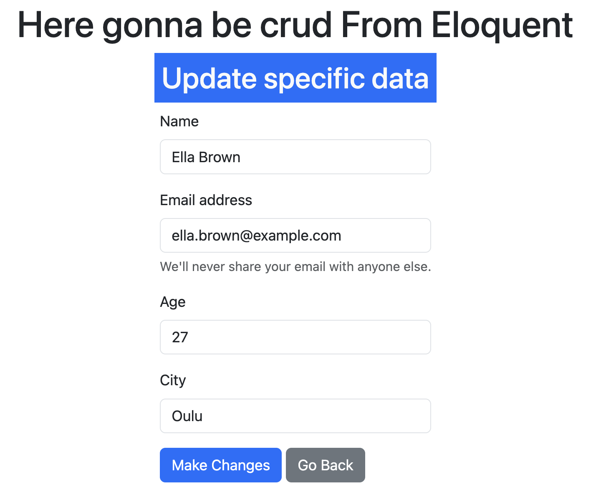
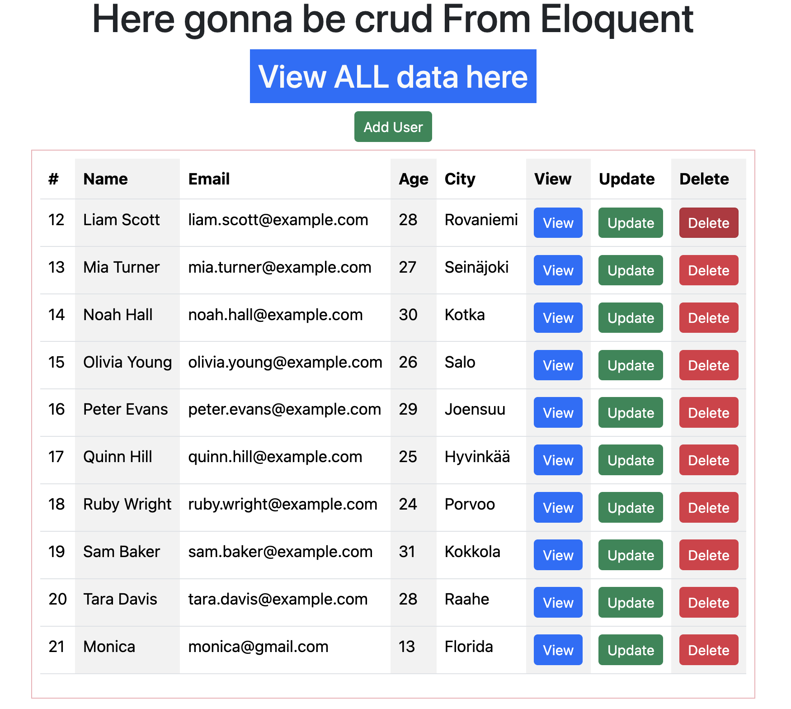

# Laravel Eloquent CRUD

A simple CRUD (Create, Read, Update, Delete) application built with **Laravel** using **Eloquent ORM**. 🚀

---

## 📌 Features

-   Add new records
-   View all records
-   Edit existing records
-   Delete records

---

## 🛠️ Installation

1. Clone this repository:
    ```bash
    git clone https://github.com/Basudev-Pokharel/LARAVEL-_ELOQUENT_CRUD.git
    ```
2. Install Dependencies

    ```bash
    composer install
    ```

3. Run migrations + seeders

    ```bash
    php artisan migrate:fresh --seed
    ```

4. Run development Server
    ```bash
    php artisan serve
    ```

> ⚠️ <span style="color:red">**Warning:**</span> You should have .env file on the root of this project.

```js
DB_CONNECTION=mysql
DB_HOST=127.0.0.1
DB_PORT=3306
DB_DATABASE=eloquent_crud
DB_USERNAME=🔴 your_username
DB_PASSWORD=🔴 password
```

## 📸 Screenshots

Here are some screenshots of the project:

<p align="center">   </p> <p align="center">   </p>

## 📄 License

This project is **free to use**. No license required.
